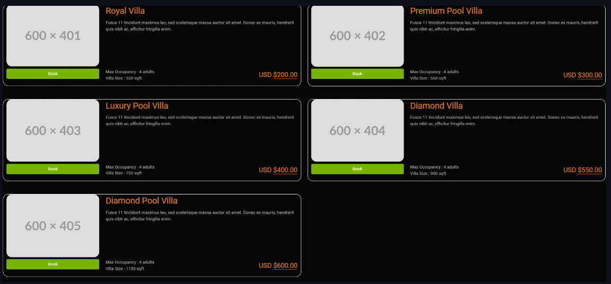

# 🏡 MagicVilla

[](LICENSE.md)
[](https://dotnet.microsoft.com/download)
[]()
[](https://localhost:<port>/swagger)

**MagicVilla** is a modern web application for managing villa listings, built with **ASP.NET Core (.NET 9)** and **Razor Pages**. It delivers a fully‑featured, versioned RESTful API, secure JWT‑based authentication, role‑based authorization, and a clean, responsive front‑end interface.


Demo Link:- https://magicvilla-dnm.azurewebsites.net/

Git Link:- https://github.com/SeifMohmmed/MagicVilla.git

---

## ✨ Features

- 🏠 **Villa Management:** Create, update, delete, and list villas with image support and amenity details.  
- 🔐 **Authentication:** Secure JWT‑based authentication with login, registration, and logout endpoints.
- 👥 **Role‑Based Access:** Admin and Customer roles with tailored permissions.  
- 📱 **API Versioning:** Versioned API (`v1`, `v2`) for backward compatibility. 
- 🖥️ **Razor Pages UI:** Clean front‑end with cookie‑based authentication.  
- 🚨 **Error Handling:** Unified API response format using `APIResponse`.  
- 🖼️ **Image Uploads:** Upload and manage villa images via API or web.
- 🔍 **Pagination & Filtering:** Filter villas by occupancy, search terms, and paginate results.  
- ⚡ **Caching Support**
- 🔄 **Automatic Database Migrations**


---

## 🧰 Technology Stack

### 🔹 Backend

- **.NET 9 / C# 13**
- **ASP.NET Core Web API**
- **Entity Framework Core** + **SQL Server**
- **JWT Authentication**
- **AutoMapper**

### 🔹 Frontend

- **ASP.NET MVC**
- **Razor Pages**
- **Bootstrap 5**
- **JavaScript**

---

## 🚀 Getting Started

### ✅ Prerequisites


* [.NET 9 SDK](https://dotnet.microsoft.com/download) ➜ `dotnet --version` ≥ 9.0 
- SQL Server
- Visual Studio 2022 or VS Code

### ⚙️ Setup

1. **Clone the repository**
   ```bash
   git clone https://github.com/SeifMohmmed/MagicVilla.git
   ```

2. **Update Connection String**
   - Navigate to `appsettings.json` in both API and Web projects
   - Update the `DefaultSQLConnection` to your SQL Server instance

3. **Apply Database Migrations**
   - The application will automatically apply pending migrations on startup
   - Alternatively, you can run manually:
     ```bash
     dotnet ef database update
     ```

4. **Run the Applications**
   - Start the API project first
   - Then start the Web project
   - API Swagger documentation will be available at: `https://localhost:[port]/`
---
## 🗂️ Project Structure

```text
MagicVilla/
├── MagicVilla.API/          # ASP.NET Core Web API (v1 & v2)
│   ├── Controllers/
│   ├── Data/                # DbContext & migrations
│   ├── Models/              # Domain models / DTOs
│   ├── Services/            # Business logic layer
│   └── Program.cs           # Entry‑point
├── MagicVilla_Web/          # Razor Pages front‑end
│   ├── Pages/
│   ├── Services/            # Typed HTTP clients
│   └── wwwroot/             # Static assets (CSS/JS/images)
├── MagicVilla_Utility/      # Shared helpers & constants
└── README.md                # You‑re‑reading‑it
```

  

## 📡 API Endpoints

### 🔄 Version 1 (v1)

| Method | Endpoint                | Description                     | Role      |
| ------ | ----------------------- | ------------------------------- | --------- |
| GET    | `/api/v1/VillaAPI`      | List villas (filter & paginate) | Anyone    |
| GET    | `/api/v1/VillaAPI/{id}` | Get villa by ID                 | Anyone    |
| POST   | `/api/v1/VillaAPI`      | Create villa                    | **Admin** |
| PUT    | `/api/v1/VillaAPI/{id}` | Replace villa                   | **Admin** |
| PATCH  | `/api/v1/VillaAPI/{id}` | Partial update                  | **Admin** |
| DELETE | `/api/v1/VillaAPI/{id}` | Delete villa                    | **Admin** |

### 📸 Version 2 (v2)

All **v1** endpoints plus:

| Method | Endpoint                      | Description                                        |
| ------ | ----------------------------- | -------------------------------------------------- |
| POST   | `/api/v2/VillaAPI/{id}/image` | Upload / replace villa image (multipart/form‑data) |

---


 ## 📦 NuGet Packages (Backend)
####  ORM
install-package Microsoft.EntityFrameworkCore.Sqlite  
install-package Microsoft.EntityFrameworkCore  
install-package Microsoft.EntityFrameworkCore.Design  

### 🔐Identity 
install-package microsoft.aspnetcore.identity.EntityFrameworkCore  
install-package microsoft.aspnetcore.identity  
install-package microsoft.identitymodel.tokens  
install-package System.IdentityModel.Tokens.Jwt 

## 🛢️ Data Storage  
using **SQL** for **Development** enviroment and **Production** also 


## 🔐 Authentication

- **API:** Uses JWT Bearer token authentication
- **Web:** Uses Cookie authentication with a 30-minute session timeout
---
## ⚙️ Configuration

Key configuration options are available in `appsettings.json`:

- Database connection string
- JWT settings
- API URLs
- Authentication settings

##🚨 Error Handling

- Custom exception middleware
- Global error handling
- Logging support
- Custom error pages

---
## 🖼️ Screenshots

<p align="center" style="display: flex; justify-content: center; gap: 8px;">
   
   
   
   
   
   
</p>

---

## Running the Project

### Prerequisites Setup

1. **Database Configuration**
   - Open `appsettings.json` in `MagicVilla.API` project
   - Update the `DefaultSQLConnection` string to your SQL Server instance:
     ```json
     "ConnectionStrings": {
       "DefaultSQLConnection": "Server=YOUR_SERVER;Database=MagicVilla;Trusted_Connection=True;MultipleActiveResultSets=true"
     }
     ```

2. **JWT Configuration**
   - In `MagicVilla.API/appsettings.json`, ensure the JWT secret key is set:
     ```json
     "ApiSettings": {
       "Secret": "YOUR_SECRET_KEY"
     }
     ```
---
### Starting the Projects

1. **Start the API Project First**
   ```bash
   cd MagicVilla.API
   dotnet run
   ```
   The API will:
   - Automatically apply any pending migrations
   - Start the Swagger UI at `https://localhost:4200/`
   - Set up static file handling for images in the `/images` directory
   - Enable JWT authentication

2. **Start the Web Project**
   ```bash
   cd MagicVilla.Web
   dotnet run
   ```
   The Web application will:
   - Start with cookie-based authentication
   - Session timeout set to 30 minutes
   - Redirect to `/Auth/Login` for unauthorized access
---
### Available Features

- **API Documentation:** Access Swagger UI at the root URL
  - Version 1: `/swagger/v1/swagger.json`
  - Version 2: `/swagger/v2/swagger.json`

- **Authentication:**
  - API uses JWT Bearer tokens
  - Web client uses cookie authentication
  - Login path: `/Auth/Login`
  - Access denied path: `/Auth/AccessDenied`

- **Static Files:**
  - Images are served from the `/images` directory in the API project
  - Access images via: `https://localhost:4200/images/[filename]`
---
### Development vs Production

- **Development Environment:**
  - Detailed error messages
  - Swagger UI available at `/swagger`
  - Exception handling with detailed information

- **Production Environment:**
  - Swagger UI available at root URL
  - HSTS enabled
  - Custom error handling middleware
  - Secure static file serving
---

